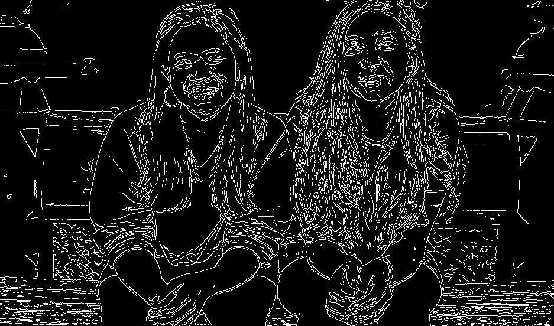
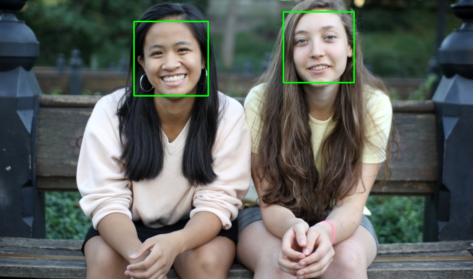

# Image Processing Basic concepts and actions using OpenCV
In this project, I implemented some of the basic concepts in image processing using OpenCV, such as:
- channelize
- gaussian blur
- rotate & resize
- edge detection
- segmentation
- face detection

## some of the result
Edge detection:

Face detection:

## How to use install OpenCV
##### Windows:
At first, you should install python, you can download at [python page](https://python.org/). Now how to install OpenCV:

Download numpy at [numpy](https://www.lfd.uci.edu/~gohlke/pythonlibs/#numpy) and openCV at [opencv](https://www.lfd.uci.edu/~gohlke/pythonlibs/#opencv).
Note : both are the same version.
Run command prompt(run it as administrator) in directory you download the files, follow the instructions blew:

`pip install "numpy-...."`

`pip install opencv-python....`

##### Mac OS X:
Open terminal, follow the instructions blew:
`sudo xcodebuild -licence`

`sudo xcode -select --install`

`ruby -e "$(curl -fsSl https://raw.githubusercontent.com/Homebrew/install/master/install)"`

`brew update`

`brew install python3`

`brew linkapps python3`

`brew tap homebrew/science`

`brew install opencv3 --without-python --with-python3`

##### PyCharm users:
After install python, you can write `import cv2` and then press `ALT`+`Enter` and select install package.

